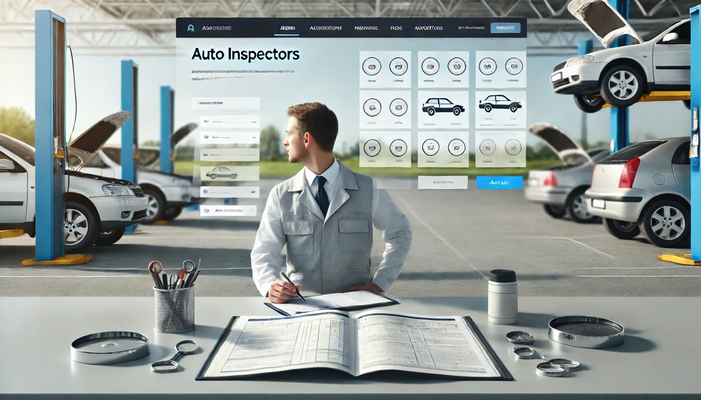
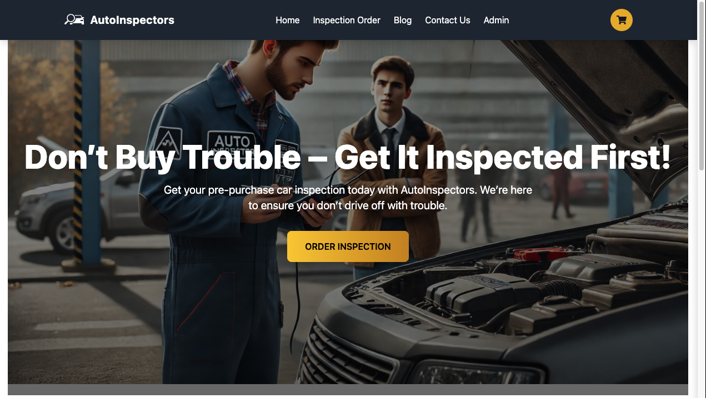

<div align="center">



# Auto Inspectors


**AutoInspectors** is an innovative startup revolutionizing vehicle inspection services. Our platform offers a seamless, user-friendly interface with advanced features and cutting-edge technology, designed to streamline and enhance the inspection process. Built with a responsive design, it ensures a consistent and optimized experience across all devices.

## **Tech Stack**
- **Frontend**: React and Vite for fast, dynamic, and modern user interfaces.
- **Backend**: Node.js and Express.js for a robust and scalable server-side architecture.
- **Hosting**: The application is hosted on [Vercel](https://vercel.com) for fast and reliable deployment.

**Check out the live application here**: [AutoInspectors](https://auto-inspectors.vercel.app/)

**AutoInspectors** is committed to leveraging technology to provide comprehensive inspection solutions, offering unmatched reliability and efficiency for our users.




</div>

---

## 📖 Table of Contents
- [🚀 Features](#-features)
- [📦 Installation](#-installation)
- [🌐 Access the Project](#-access-the-project)
- [🔧 Frameworks and Technologies](#-frameworks-and-technologies)
- [🛠️ Usage Instructions](#%EF%B8%8F-usage-instructions)
- [✅ Testing](#-testing)
- [📢 Acknowledgments](#-acknowledgments)

---

## 🚀 Features

- **Fully Responsive**: Optimized for all devices and screen sizes.
- **Accessibility Compliant**: ARIA roles and labels ensure inclusivity.
- **Interactive UI**: Built for smooth and dynamic user interactions.
- **Error Handling**: Error boundaries for a seamless user experience.

---

## 📦 Installation

### Clone the Repository
```bash
  https://github.com/hamzam2mhs/AutoInspectors.git
  cd AutoInspectors
```
---

## 🌐 Access the Project
### Live Demo: [AutoInspectors](https://auto-inspectors.vercel.app/)

---

## 🔧 Frameworks and Technologies

1. React
2. Vite
3. Node.js
4. Express.js
5. MongoDB

## 🛠️ Usage Instructions

1. **Run the application locally**  
   Start the development server by running the following command:
   ```bash
   npm start

---

## 📦 Installation

### Clone the Repository
```bash
  https://github.com/hamzam2mhs/AutoInspectors.git
  cd AutoInspectors
```

---

## ✅ Testing
### Run the test suite using:
```bash
   npm test
```

---

## 📢 Acknowledgments
### Developed by: Muhammad Hamza
### Hosted on: Vercel
### Special Thanks: To my amazing team members Rayan Imran & Hassan Nauman for their invaluable contributions in starting and shaping this project.
